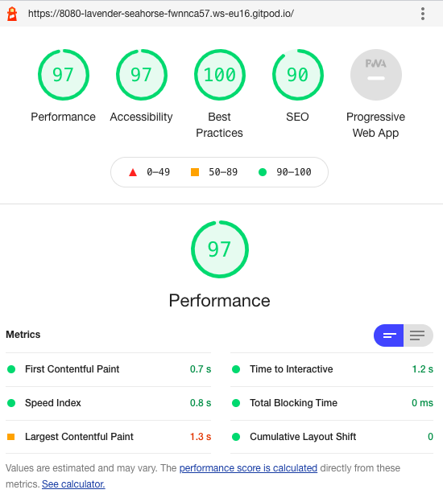
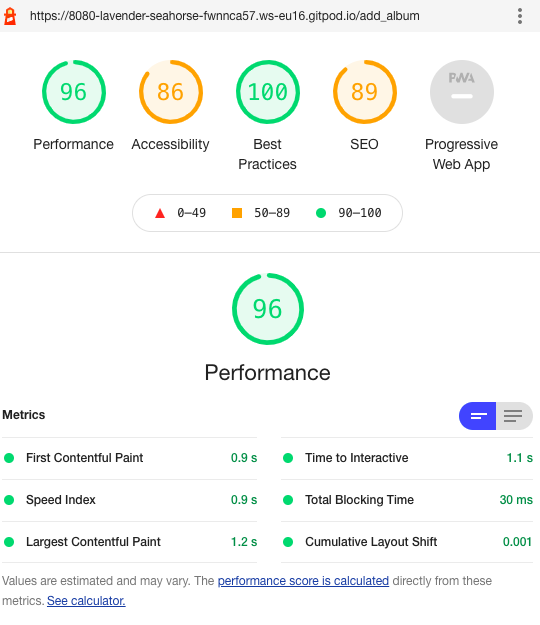
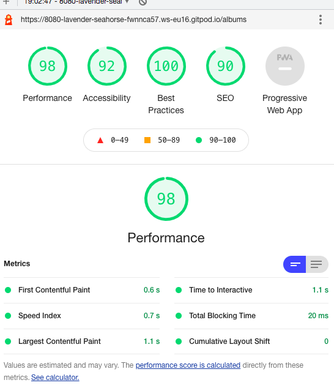
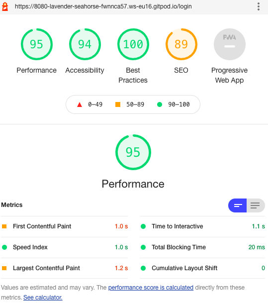
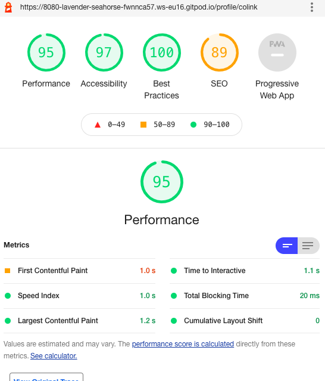

# Colin Keenaghan - Milestone Project 3
## ALbum Review Club

[Visit my live website here!](https://read-it-ms3.herokuapp.com/)

# Table Of Contents

1. [Overview](#overview)
2. [UX](#ux)
    - [Target Audience](#target-audience)
    - [User Stories](#user-stories)
3. [Design](#design)
    - [Wireframes](#wireframes)
    - [Typography](#typography)
    - [Colours](#colours)
    - [Database](#database)
4. [Features](#features)
    - [Current Features](#current-features)
    - [Future Features](#future-features)
5. [Technologies Used](#technologies-used)
    - [Languages](#languages)
    - [Database](#database)
    - [Frameworks Libraries and Programmes](#frameworks-libraries-and-programmes)
6. [Testing](#testing)
7. [Deployment](#deployment)
8. [Credits](#credits)

# Overview

The Album Review Club is a place for music lovers to join an open minded and expressive group. They can register and view reviews from people wanting to share their favourite albums. They can also leave their own review and share their favourite albums.

[Back to contents](#table-of-contents)

# UX

## Target Audience

The target audience for my site is people who are music lovers. This is a site where they can express their opinion on their favourite albums and also learn about new amazing undiscovered albums.
## User Stories

### First Time and Returning Users

All users of this site will be looking for similar things, outlined below;
-	Easy and clear navigation throughout the entire site on all device types.
-	Have clear Registration/Log In pages.
-	Have the ability to add their own reviews and keep a record of them.
-	To be able to edit and delete reviews posted.
-	For the review information to be clear and concise.
-	Once finished, to securely log out of the site.

[Back to contents](#table-of-contents)

# Design

## Wireframes

To create the wireframes, I used Balsamiq. 

-	[Mobile](static/images/wireframes/mobilewf.pdf)
-	[Desktop/Laptop](static/images/wireframes/desktopwf.pdf)

## Colours
The only real additional color used was teal to make buttons and headings stand out and more appealing.

## Database
I used MongoDB as the database for this project. This projects database uses four collections;
-	Users
-	Categories
-	Albums

### Users

Storing users usernames and passwords allows users to register and log in/log out securely. 

### Categories

In the category section I held the genre types for the albums

### Albums

When a user added a new album the data was stored in this collection the album name, artist etc.

# Features

## Current Features

### Home Page
The home page is a simple layout using images and some brief paragraphs to give the user and overall idea of what the site is about
and what they can expect when they register an account.

### Add/Edit Album
This page will provide a form for user to fill and add/edit their review. They will give some basic info on the album like release date etc. Then they will write their review and express their thoughts with other users. If they change their mind ....no problem
and edit button is provided and user can simply adjust their form and save their new album review.

### Log in/Log out/Register
Simple forms that create the user info and stored in the database. Once they register they have access to the site functions 
and can log in and log out as needed.

[Back to contents](#table-of-contents)

# Technologies Used

## Languages

-	HTML5
-	CSS3
-	Javascript
-	Python3

## Database

-	Mongo DB

## Frameworks Libraries and Programmes

Flask
- A python web framework.

Jinja
- Template used by Flask and Python.

PyMongo
- Python tool for use with Mongo DB.

Werkzeug
- WSGI web application library used by Flask and Python.

Balsamiq - https://balsamiq.com/ 
- I used Balsamiq to create the wireframes for my project.

Font Awesome – https://fontawesome.com/ 
- Icons from Font Awesome were used throughout the site.  

Github – https://github.com/ 
- Github was used to store the code for my project.

Gitpod – https://gitpod.io/workspaces/ 
- I used Gitpod to write the code for my project and push it to Github.

Google Fonts – https://fonts.google.com/ 
- I used Google Fonts to find the right font for my project.

Heroku - https://id.heroku.com/login 
- Heroku was used to deploy the project. 

jQuery – https://jquery.com/
- jQuery was used for the main functions due to ease of use.

MaterializeCSS - https://materializecss.com/ 
- For this project, I used MaterializeCSS to help with the styling, layout and responsiveness of the finished site.

[Back to contents](#table-of-contents)

# Testing
1. [Code Validation](#code-validation)
    - [HTML5](#html5)
    - [CSS3](#css3)
    - [JS](#js)
    - [Python](#python)

    ### Lighthouse Testing 
* Home Page: Desktop

* Add Album: Desktop

* Albums: Desktop

* Login: Desktop

* Profile: Desktop

[Back to contents](#table-of-contents)

